::: {.full-width-title}
::: {.section-title-container}
## Project Documentation {.section-title}
:::
:::

::: {.section-title-container}
## Abstract {.section-title}
:::

::: {style="max-width: 800px; margin: 0 auto; text-align: center; padding: 0 var(--space-8); width: 100%; box-sizing: border-box;"}
This project aims to adapt the existing Invisible Drum Set—originally implemented with an Arduino Nano and BNO055 IMU sensor—onto the E155 hardware platform, consisting of an STM32 MCU and UPduino FPGA. It will enable playing virtual drums through air gestures detected by the IMU, with real-time audio synthesis and low latency.
:::

::: {.section-title-container}
## System Overview {.section-title}
:::

Each drumstick is designed as a fully independent embedded system, containing its own BNO085 sensor, Arduino Nano ESP32, FPGA, and STM32 microcontroller. This distributed architecture ensures that the left and right sticks remain electrically and logically isolated — improving robustness, reducing latency, and making the system scalable to additional sticks in the future.

The data pipeline in each stick relies on multiple communication protocols between its hardware components. The BNO085 sensor communicates with the Arduino Nano ESP32 using the I²C protocol, with the high-level SHTP protocol layered on top to enable structured transfer of fused motion data. Once the sensor data is received by the ESP32, it is forwarded to the FPGA over an SPI interface, where the FPGA operates as the SPI slave and the ESP32 serves as the SPI master. On the FPGA, the data is packaged into a custom packet format and relayed to the MCU for trigger processing.

From there, the FPGA sends the packaged data to the STM32 microcontroller through a second SPI link, again with the FPGA acting as the slave and the STM32 as the master. The microcontroller performs gesture recognition to detect drumming motions, and the resulting sound IDs (0–7) are output through a digital-to-analog converter (DAC) to drive a speaker that plays the correct drum sound.

**Files responsible for FPGA packaging:**

- `arduino_spi_slave.sv` — Receives 16-byte packets from Arduino via SPI. Buffers the packet and converts components from Quaternion to Euler Conversion with DSP multipliers (Header, Roll, Pitch, Yaw, Gyro X/Y/Z, Flags) and synchronizes it to the FPGA clock domain.

- `spi_slave_mcu.sv` — Sends the packet buffer to the MCU via SPI. Acts as an SPI slave to the MCU, shifting out the 16-byte packet buffer byte-by-byte when the MCU requests data.

- `drum_trigger_top.sv` — Top-level module that connects the two SPI slaves. Instantiates arduino_spi_slave and spi_slave_mcu, passing the packet buffer from Arduino to MCU.

**Packet Format:**

Each package is passed as:

- Byte 0: Header (0xAA)
- Bytes 1-2: Roll (int16_t, MSB first) - Euler angle scaled by 100
- Bytes 3-4: Pitch (int16_t, MSB first) - Euler angle scaled by 100
- Bytes 5-6: Yaw (int16_t, MSB first) - Euler angle scaled by 100
- Bytes 7-8: Gyro X (int16_t, MSB first) - scaled by 2000
- Bytes 9-10: Gyro Y (int16_t, MSB first) - scaled by 2000
- Bytes 11-12: Gyro Z (int16_t, MSB first) - scaled by 2000
- Byte 13: Flags (bit 0 = Euler valid, bit 1 = Gyro valid)
- Bytes 14-15: Reserved (0x00)

This multi-protocol, distributed architecture enables reliable motion data transfer across all processing elements in each stick. The correct functionality of each communication stage is demonstrated in the Results section of this report.

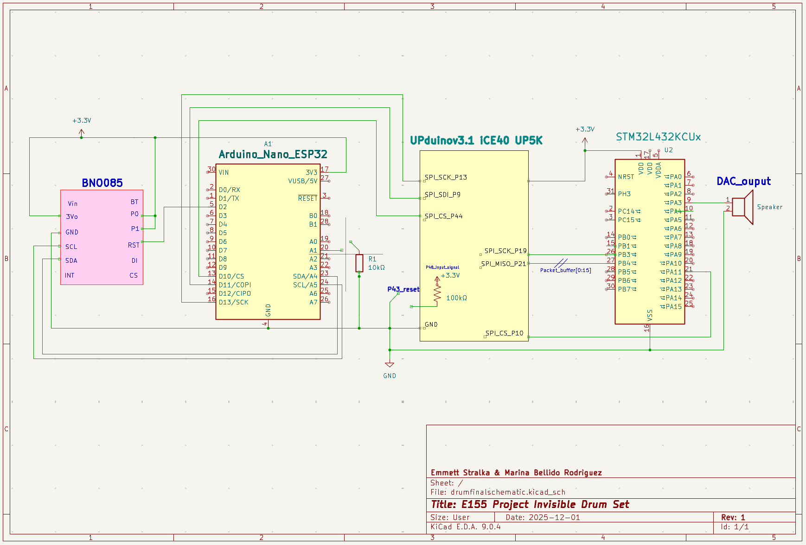{width="80%" style="max-width: 800px; margin: 2rem auto; display: block;"}

*Figure: Schematic diagram of the System*

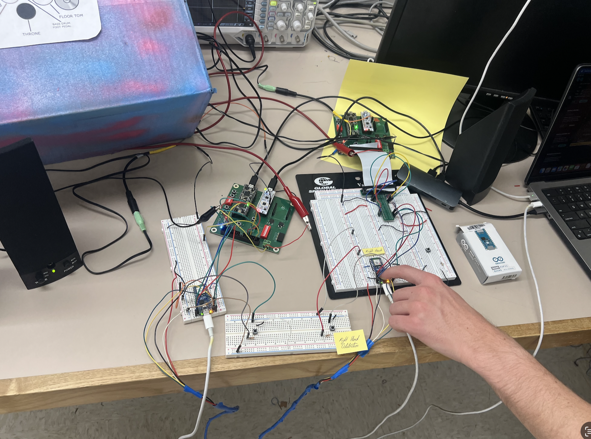{width="80%" style="max-width: 800px; margin: 2rem auto; display: block;"}

::: {.section-title-container}
## FPGA Design Details {.section-title}
:::

Initially, we attempted to configure the BNO085 sensors directly from the FPGA using a 11-state finite state machine (FSM) with encoding logic implemented using DSP blocks and BRAM (Block RAM) resources. This approach aimed to handle the Sensor Hub Transport Protocol (SHTP) communication directly on the FPGA, including sensor initialization, command encoding, and data packet parsing. While this implementation successfully extracted data from the sensors (as shown in the figure below), the approach proved unreliable in practice.

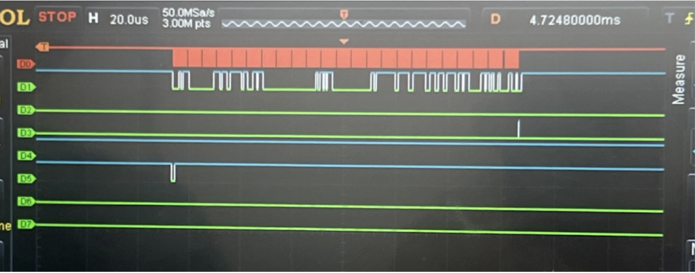{width="80%" style="max-width: 800px; margin: 2rem auto; display: block;"}

*Figure: FPGA data output trace on Logic Analyzer with FPGA configuration and initialization (more information in Appendix A)*

The system experienced inconsistent connection behavior, with data transmission failures and intermittent communication errors that prevented stable operation. The complexity of managing SHTP protocol timing, interrupt handling, and state transitions at the hardware level made it difficult to achieve the reliability required for real-time drum triggering.

Given the reliability challenges with the FPGA-based sensor configuration, we transitioned to a more reliable hybrid architecture that leverages the strengths of each component:

1. **Arduino ESP32**: Handles sensor configuration and data acquisition using the mature Adafruit_BNO08x library, which provides robust SHTP protocol handling and reliable sensor communication over I²C. This approach proved significantly more reliable than the FPGA-based sensor configuration.

2. **FPGA**: Receives pre-processed sensor data from the Arduino via SPI and packages it into a custom transmission format optimized for the MCU interface. The FPGA's role shifted from sensor management to efficient data packaging and routing.

3. **STM32 MCU**: Decodes the packaged data packets from the FPGA, identifies drum triggers based on gesture patterns, and outputs audio samples through the DAC to drive the speaker.

This transition to using Arduino for sensor data acquisition and FPGA for data packaging provided the reliability and consistency needed for real-time operation, while maintaining the FPGA's role in efficient data processing and the MCU's role in audio playback.

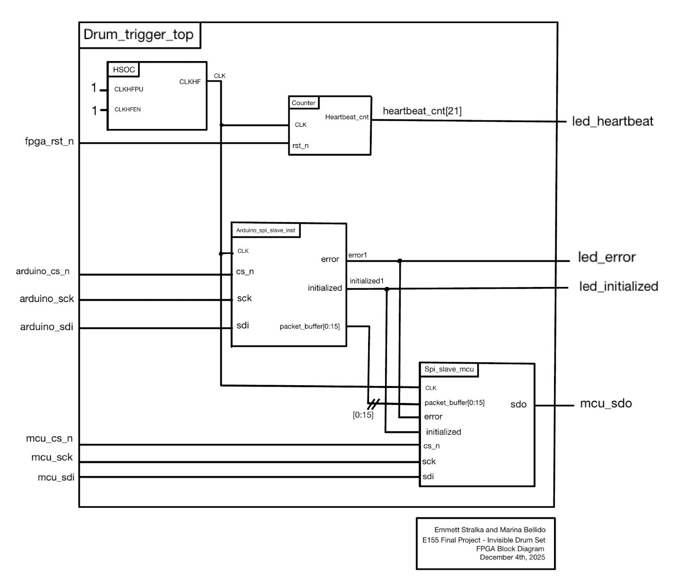{width="80%" style="max-width: 800px; margin: 2rem auto; display: block;"}

*Figure: Top FPGA Module*

`drum_trigger_top.sv` instantiates two submodules that handle the SPI interfaces on each side: `arduino_spi_slave_init.sv`, which implements the SPI Mode 0 slave interface to the Arduino by receiving 16-byte raw sensor packets, shifting the data in during each SCK rising edge, synchronizing it into the FPGA clock domain, validating the header byte, and exposing a stable packet buffer for downstream processing; and `spi_slave_mcu.sv`, which acts as a read-only SPI Mode 0 slave to the MCU, outputting those 16-byte packets on MISO as the MCU generates dummy clock cycles, enabling direct transfer of the synchronized sensor data to the MCU for parsing and drum-trigger computation.

**Code Repository:** [FPGA Source Code](https://github.com/stremme1/E155_Final_SPI_Test/tree/main/fpga)
:::

::: {.section-title-container}
## MCU Design Details {.section-title}
:::

The STM32 microcontroller decodes the packaged data packets from the FPGA, identifies drum triggers based on gesture patterns, and outputs audio samples through the DAC to drive the speaker. This transition to using Arduino for sensor data acquisition and FPGA for data packaging provided the reliability and consistency needed for real-time operation, while maintaining the FPGA's role in efficient data processing and the MCU's role in audio playback.

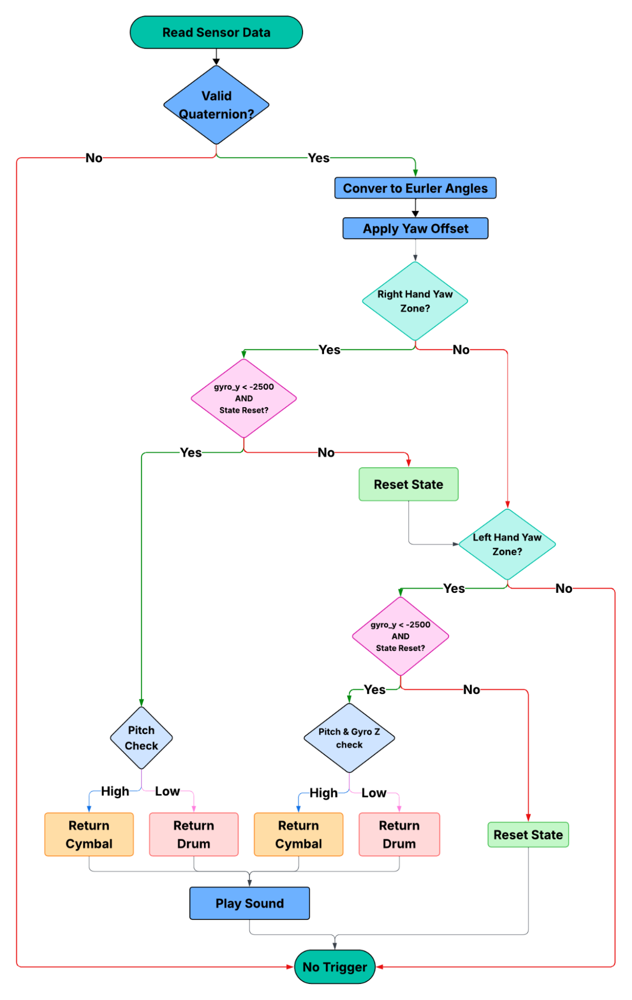{width="80%" style="max-width: 800px; margin: 2rem auto; display: block;"}

*Figure: MCU main control loop flowchart for dual-hand invisible drum system.*

### 1. Main Application Files

This section contains the entry points for the system and the logic for the main control loops.

- **`main.c`** Main entry point for dual-hand drum trigger system. Initializes hardware (DAC, SPI, buttons), reads sensor data from SPI, processes both sensors, and plays drum sounds when triggers detected.

- **`main_left.c`** Single-hand version processing only left hand sensor. Uses left-hand-only detection logic for simplified testing.

- **`main_right.c`** Single-hand version processing only right hand sensor. Uses right-hand-only detection logic for simplified testing.

### 2. Detection Logic

Files responsible for interpreting sensor data against the drum zone map.

- **`drum_detector.c`** Core drum trigger detection using yaw zones, pitch thresholds, and gyroscope readings. Checks both sensors against predefined zones and returns drum codes (0x00-0x07) when strike conditions met.

The following logic pertains to each left and right hand sensor:

| Code | Instrument | Hand | Yaw Range (°) | Pitch / Condition | Gyro Y | Gyro Z |
|------|------------|------|---------------|-------------------|--------|--------|
| 0x00 | SNARE | Right | 20° - 120° | Any | < -2500 | Any |
| 0x00 | SNARE | Left | 350° - 100° | ≤ 30° OR Gyro Z ≤ -2000 | < -2500 | Any |
| 0x01 | HIHAT | Left | 350° - 100° | > 30° | < -2500 | > -2000 |
| 0x02 | KICK | Button | N/A | N/A | N/A | N/A |
| 0x03 | HIGH_TOM | Right | 340° - 20° | ≤ 50° | < -2500 | Any |
| 0x03 | HIGH_TOM | Left | 325° - 350° | ≤ 50° | < -2500 | Any |
| 0x04 | MID_TOM | Right | 305° - 340° | ≤ 50° | < -2500 | Any |
| 0x04 | MID_TOM | Left | 300° - 325° | ≤ 50° | < -2500 | Any |
| 0x05 | CRASH | Right | 340° - 20° | > 50° | < -2500 | Any |
| 0x05 | CRASH | Left | 325° - 350° | > 50° | < -2500 | Any |
| 0x06 | RIDE | Right | 305° - 340° | > 50° | < -2500 | Any |
| 0x06 | RIDE | Right | 200° - 305° | > 30° | < -2500 | Any |
| 0x06 | RIDE | Left | 300° - 325° | > 50° | < -2500 | Any |
| 0x06 | RIDE | Left | 200° - 300° | > 30° | < -2500 | Any |
| 0x07 | FLOOR_TOM | Right | 200° - 305° | ≤ 30° | < -2500 | Any |
| 0x07 | FLOOR_TOM | Left | 200° - 300° | ≤ 30° | < -2500 | Any |

### 3. Sensor Processing

- **`bno085_decoder.c`** Converts BNO085 quaternion data (Q14 format) to Euler angles (roll, pitch, yaw). Normalizes yaw to 0-360° range for zone checking.

### 4. Audio Playback

- **`audio_player.c`** Maps drum codes to WAV sample arrays and plays sounds via DAC. Prevents overlapping playback using is_playing flag.

### 5. Hardware Abstraction Layer (STM32L432KC)

Low-level drivers for peripheral configuration and control.

- **`STM32L432KC_DAC.c`** Configures DAC peripheral for audio output on PA4. Implements WAV playback using timer interrupts at specified sample rates.

- **`STM32L432KC_SPI.c`** SPI slave mode communication to receive 16-byte sensor data packets from Arduino/ESP32 master. Parses quaternion and gyroscope data.

- **`STM32L432KC_USART.c`** USART configuration for debug serial communication. Provides low-level byte/string transmission functions.

- **`STM32L432KC_GPIO.c`** GPIO pin configuration and control. Implements pinMode(), digitalRead(), digitalWrite() for buttons and SPI pins.

- **`STM32L432KC_RCC.c`** Clock configuration setting system clock to 80MHz. Enables peripheral clocks for GPIO, SPI, USART, DAC, and timers.

- **`STM32L432KC_FLASH.c`** Flash memory configuration for 80MHz operation. Sets wait states and enables prefetch buffer.

- **`STM32L432KC_TIMER.c`** Timer functions for delays. Implements ms_delay() for button debouncing and audio timing.

### 6. Debug & Utilities

- **`debug_print.c`** Debug logging using USART with printf-style formatting. Used for debugging sensor data and system state.

- **`wav_arrays/`** Directory with WAV samples converted to C arrays. Contains all 8 drum samples as 16-bit PCM data.

**Code Repository:** [MCU Source Code](https://github.com/stremme1/E155_Final_SPI_Test/tree/main/mcu)
:::

::: {.section-title-container}
## New Hardware {.section-title}
:::

### BNO085 IMU: Sensor and Communication Protocol

The BNO085 is a 9-axis intelligent IMU that integrates an accelerometer, gyroscope, and magnetometer with an onboard sensor-fusion processor. Instead of exposing raw sensor registers directly, the BNO085 communicates through the Sensor Hub Transport Protocol (SHTP) — a structured, packet-based protocol that runs over standard physical interfaces including I²C, SPI, or UART, depending on the configuration of the protocol-select pins at startup.

SHTP organizes all communication into channels, each dedicated to a specific type of information. For example, there are channels for configuration commands, sensor data streams, and control/status messages. Each channel maintains its own sequence number, which ensures that the host can detect lost or out-of-order packets and reliably manage multiple data streams at once.

Each SHTP transmission consists of a packet header followed by a payload. The 4-byte header contains the total packet length (including header), the channel number, and the channel's sequence number. The payload begins with a Report ID, which defines the type of data being transmitted, followed by the actual sensor data bytes. Depending on the enabled reports, this data may include raw motion readings or fully fused orientation outputs such as rotation vectors, quaternions, or yaw-pitch-roll angles. The BNO085 continually sends these report packets to the host at the configured update rate, allowing efficient and low-latency motion tracking without requiring any external fusion algorithms.

By using SHTP and a multi-channel packet architecture, the BNO085 provides robust and synchronized delivery of motion data, while offloading the heavy computational cost of sensor fusion from the host processor. This makes the sensor well-suited for high-performance embedded applications such as robotics, VR/AR motion controllers, and human-motion tracking systems.

The BNO085 contains an onboard MCU that runs embedded fusion firmware, enabling it to perform its own signal processing and generate orientation data autonomously. Inside the sensor package, there is an ARM Cortex-M0+ microcontroller running Bosch's BSX Lite fusion firmware (or CEVA SH-2/SH-2A depending on version). This embedded software performs:

- Sensor fusion (combining accel + gyro + mag)
- Calibration and drift compensation
- Report generation and timestamping
- SHTP communication handling

This is why the BNO085 can output high-level motion data like quaternions and rotation vectors instead of only raw sensor values — the processing is already happening inside the chip.

**More information on the SHTP protocol can be found in the datasheet:** [BNO080_085-Datasheet](https://www.ceva-ip.com/wp-content/uploads/BNO080_085-Datasheet.pdf)

### Arduino ESP32: Interface and Library Integration

To collect and process motion data from the BNO085 sensor, the system uses an Arduino Nano ESP32 as the host microcontroller. This board combines the ESP32-S3's processing power with the ease of the Arduino ecosystem, while also providing integrated Wi-Fi and Bluetooth connectivity. Its larger memory capacity makes it well-suited for handling advanced sensor-fusion libraries.

To communicate with the IMU, the Arduino implements the Adafruit_BNO08x library, which provides a high-level application interface for the BNO085 sensor. Instead of requiring manual parsing of Sensor Hub Transport Protocol (SHTP) packets, the library abstracts low-level communication and directly exposes orientation and motion data in a structured format. Through simple API calls, the application can initialize the sensor, enable specific data reports, and retrieve quaternion or Euler-angle outputs with precise timestamps.

The communication between the Arduino ESP32 and the BNO085 uses the I²C protocol, following a typical configuration where SDA and SCL lines connect to the board's dedicated I²C pins, and the device uses its default I²C address (0x4A). Once initialized with `begin_I2C()`, the system activates the desired sensor-fusion reports, such as the rotation vector, through `enableReport(...)`. During runtime, calls to functions like `getSensorEvent(...)` return the latest fused motion data, processed internally by the sensor's onboard firmware.

Together, the Arduino Nano ESP32 platform and the Adafruit_BNO08x library provide a compact and efficient solution for retrieving motion-tracking information from the BNO085, while minimizing implementation complexity and host processing requirements.

**Adafruit_BNO08x library:** [GitHub Repository](https://github.com/adafruit/Adafruit_BNO08x)
:::

::: {.section-title-container}
## Results {.section-title}
:::

Below you can observe the final build and performance of our invisible drum set.

{width="80%" style="max-width: 800px; margin: 2rem auto; display: block;"}

*Figure: Full Dual-Stick Embedded System Prototype*

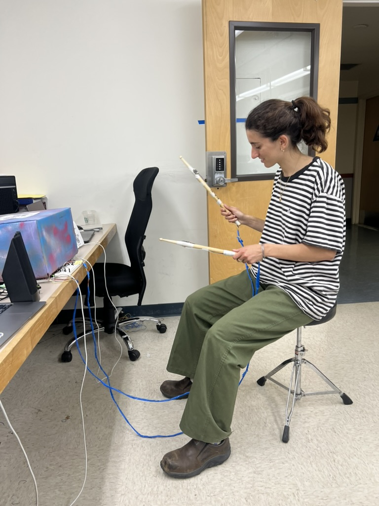{width="80%" style="max-width: 800px; margin: 2rem auto; display: block;"}

*Figure: User Testing of the Dual-Stick Invisible Drum Set Prototype*

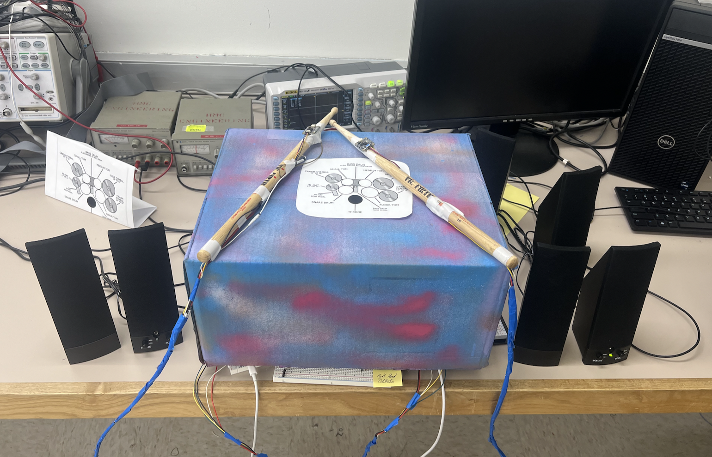{width="80%" style="max-width: 800px; margin: 2rem auto; display: block;"}

*Figure: Final Prototype Assembly with Integrated Speaker Output*

### Working Protocols

#### I2C Data Transmission between BNO085 - Arduino

Before validating the SPI interface, the correct operation of the BNO085 sensor stream was confirmed using the Arduino Serial Monitor. As shown in the figure below, the Arduino receives fused motion data from SHTP Channel 2, including Euler angles and gyroscope measurements. The reported Status = 1 confirms valid quaternion and gyro results, while the dt field demonstrates a stable sampling interval. This establishes that the sensor is configured correctly prior to forwarding data over SPI.

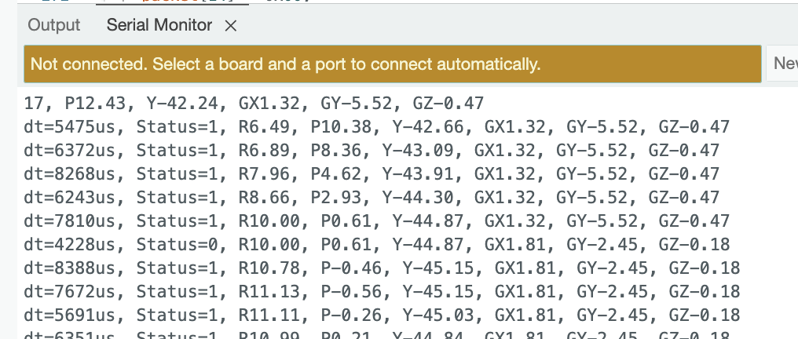{width="80%" style="max-width: 800px; margin: 2rem auto; display: block;"}

*Figure: Arduino Serial Monitor Sensor Data*

#### SPI Data Transmission between ESP32 - FPGA: Validation Using Logic Analyzer

To verify correct data transfer between the Arduino ESP32 and the FPGA, the SPI bus was monitored using a logic analyzer. The captured waveform confirms that the expected byte sequence is transmitted from the Arduino to the FPGA when new motion data is available.

In the SPI trace, the Chip Select (CS) line goes low to initiate communication, and the Serial Clock (SCLK) drives the shifting of bits on the MOSI line. The logic analyzer successfully decodes the transmitted bytes, showing the correct formatting of the motion-data packet. The packet begins with the synchronization header 0xAA, followed by three 16-bit signed values corresponding to the Euler angles (roll, pitch, yaw), encoded in MSB-first two's-complement representation:

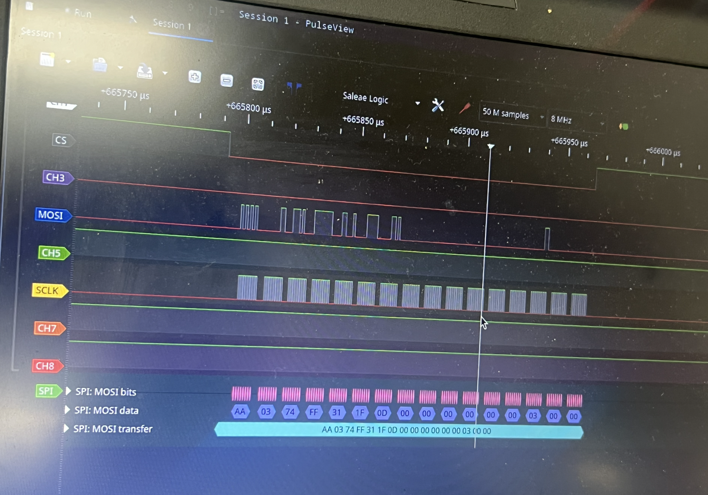{width="80%" style="max-width: 800px; margin: 2rem auto; display: block;"}

*Figure: Logic Analyzer with outputted SPI Protocol*

| Parameter | Raw Bytes (Hex 2s Complement) | Value (Decimal) | Interpretation |
|-----------|-------------------------------|-----------------|----------------|
| Header | AA | — | Packet start marker |
| Roll | 03 74 | 0x0374 = 884 | Represents ~88.4° after dividing by 10 |
| Pitch | FF 31 | 0xFF31 = –207 | Represents ~–20.7° after dividing by 10 |
| Yaw | 1F 0D | 0x1F0D = 7949 | Represents ~794.9° (before wrap-around handling) |

This successful logic-level validation demonstrates that:

- The decoded values shown in the logic analyzer match the same roll, pitch, and yaw values printed in the Arduino serial monitor, confirming full consistency between software-level and wire-level communication.
- The SPI protocol is functioning correctly.
- The data formatting (header + signed angle values) matches the intended system design.

This result confirms that the Arduino-to-FPGA stage of the communication pipeline is reliable, and it establishes confidence in the real-time transmission path used in the complete system.

#### SPI Data Transmission between FPGA - MCU: Validation Using Logic Analyzer

To verify correct data transfer between the FPGA and the MCU, the SPI bus was monitored using a test_bench and a logic analyzer. As we can observe in the figure below, we added a test pattern in module `spi_slave_mcu.sv` and then we can observe how that same packet was transmitted correctly in the MCU Segger debug terminal. This shows that the SPI protocol works correctly.

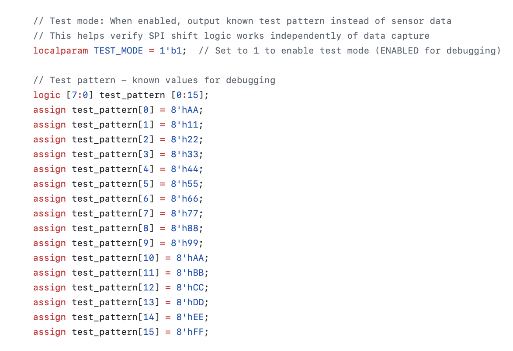{width="80%" style="max-width: 800px; margin: 2rem auto; display: block;"}

*Figure: spi_slave_mcu test pattern*

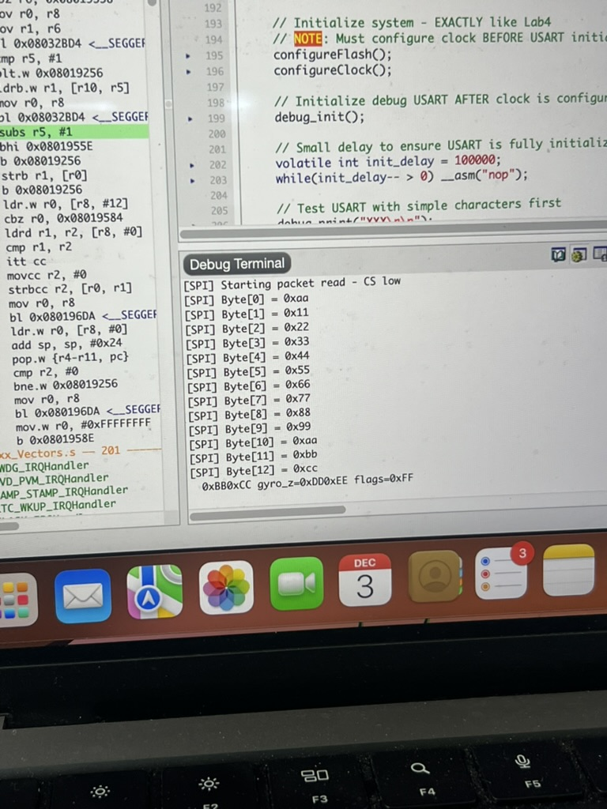{width="80%" style="max-width: 800px; margin: 2rem auto; display: block;"}

*Figure: Segger Debug Terminal outputting MCU receiving the correct test pattern*

As shown in the figure below, the MCU successfully receives the formatted 16-byte packets transmitted through the FPGA. These packets originate from SHTP Channel 2, which is the dedicated fused-sensor data stream of the BNO085. The Arduino firmware parses the incoming SHTP frames and extracts only the motion-tracking payload, removing the original SHTP header before re-packaging the data for SPI transmission. Each packet begins with a synchronization header byte (0xAA), followed by fused orientation and inertial measurements encoded as signed 16-bit integers (MSB-first). A status/flags byte indicates data validity, and two trailing bytes are reserved for potential future use. This structure allows the MCU to efficiently decode motion data in real time while ensuring reliable packet boundary detection.

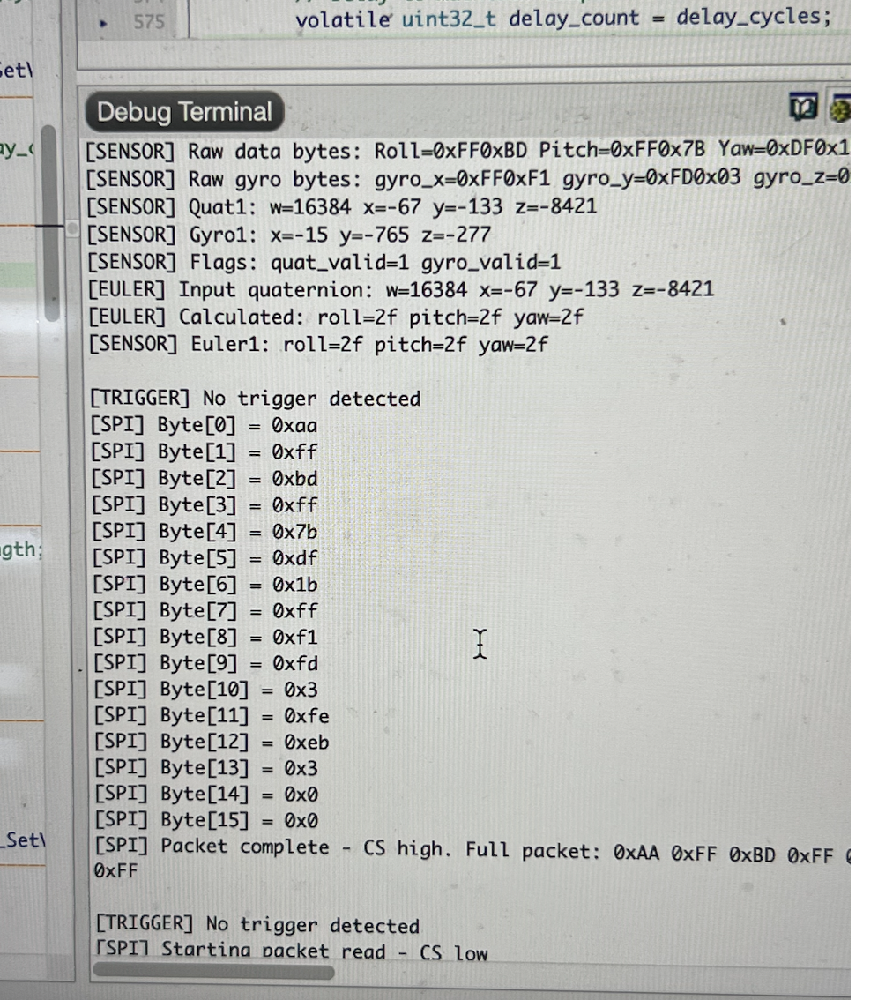{width="80%" style="max-width: 800px; margin: 2rem auto; display: block;"}

*Figure: MCU Debug Terminal output displaying the 16-byte SPI packet received from the FPGA, including the 0xAA synchronization header and sensor data originating from SHTP Channel 2.*

| Byte Index | Field | Description |
|------------|-------|-------------|
| 0 | 0xAA | Sync header marking start of packet |
| 1–2 | Roll | int16 (MSB first) |
| 3–4 | Pitch | int16 |
| 5–6 | Yaw | int16 |
| 7–8 | Gyro X | int16 |
| 9–10 | Gyro Y | int16 |
| 11–12 | Gyro Z | int16 |
| 13 | Flags | Data validity + status (from SHTP Channel 2 report) |
| 14–15 | Reserved | Future expansion |

*Table: Custom 16-byte SPI packet structure used for transmitting fused orientation and inertial data from the Arduino through the FPGA to the MCU. The packet includes a 0xAA synchronization header followed by sensor measurements and status information extracted from SHTP Channel 2 reports.*

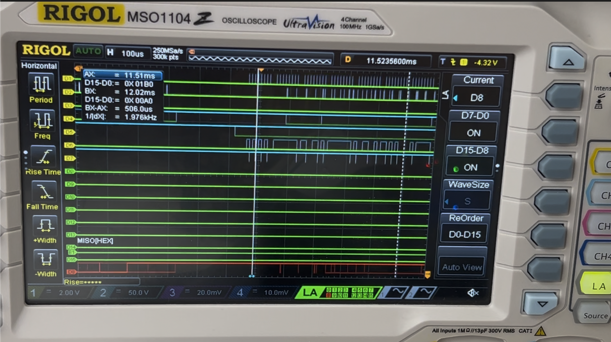{width="80%" style="max-width: 800px; margin: 2rem auto; display: block;"}

*Figure: Logic Analyzer showcasing the SPI Protocol*

#### DAC Working

To verify audio output capability and confirm correct DAC initialization, the MCU firmware begins by sequentially playing each stored drum sample at startup. As shown in the figure below, the debug log confirms successful SPI configuration, DAC activation, and playback of all seven drum sounds (Kick, Snare, Hi-Hat Closed, Hi-Hat Open, Crash, Ride, Tom High, Tom Low). This provides a functional baseline test proving that the audio subsystem is fully operational before real-time trigger detection begins.

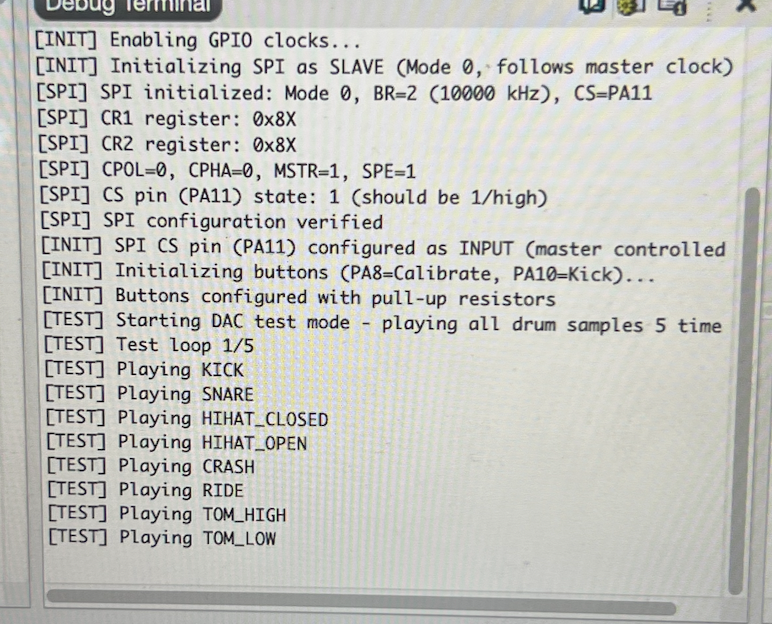{width="80%" style="max-width: 800px; margin: 2rem auto; display: block;"}

*Figure: Initialization of all drum sounds outputted by the DAC*

::: {.section-title-container}
## Code Repository {.section-title}
:::

[View Complete Source Code on GitHub](https://github.com/stremme1/E155_Final_SPI_Test){.btn .btn-primary target="_blank" style="display: block; text-align: center; margin: 2rem auto; max-width: 300px;"}

The repository contains all source code, including FPGA Verilog modules, MCU C code, Arduino/ESP32 code, testbenches, and documentation files.

- [FPGA Source Code](https://github.com/stremme1/E155_Final_SPI_Test/tree/main/fpga)
- [MCU Source Code](https://github.com/stremme1/E155_Final_SPI_Test/tree/main/mcu)
:::

::: {.section-title-container}
## Technical Information {.section-title}
:::

### Bill of Materials

| Material | Quantity | Cost | Total |
|----------|----------|------|-------|
| 2 BNO085 IMU sensors | 2 | $24.95 | $49.90 |
| Speaker 8Ω 4W | 1 | Stockroom | $0.00 |
| 2 switches drums | 2 | Stockroom | $0.00 |
| Potentiometer | 1 | Stockroom | $0.00 |
| SD CARD | 1 | Stockroom | $0.00 |
| **TOTAL** | | | **$49.90** |

*Total estimated cost under $50, excluding development hardware.*

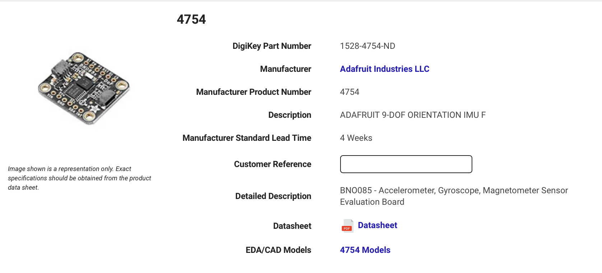{width="80%" style="max-width: 800px; margin: 2rem auto; display: block;"}

*Figure: BNO085 information on the digikey website*
:::

::: {.section-title-container}
## References {.section-title}
:::

- [BNO055 Datasheet](https://cdn-shop.adafruit.com/datasheets/BST_BNO055_DS000_12.pdf)
- [STM32L432KC Documentation](https://www.st.com/en/microcontrollers-microprocessors/stm32l432kc.html#documentation)
- [UPduino Documentation](https://upduino.readthedocs.io/en/latest/)
- [Invisible Drum Set (Original)](https://github.com/HafthorArni/Invisible-Drum-Set)
- [HMC E155 Lab 7 SPI Code](https://github.com/HMC-E155/hmc-e155/blob/main/lab/lab07/lab07_mcu/lib/STM32L432KC_SPI.c)
- [HMC E155 Project Website](https://hmc-e155.github.io/project/)
- [Arduino ESP32 Spec](https://docs.arduino.cc/tutorials/nano-esp32/cheat-sheet/#spi)
- [BNO08x Datasheet](https://docs.sparkfun.com/SparkFun_VR_IMU_Breakout_BNO086_QWIIC/assets/component_documentation/BNO080_085-Datasheet_v1.16.pdf)
- [BNO085 Sensor (Adafruit)](https://www.adafruit.com/product/4754?gad_source=1&gad_campaignid=21079267614&gbraid=0AAAAADx9JvRgjNv8OxXekStexoGHD-hAp&gclid=CjwKCAiA3L_JBhAlEiwAlcWO5zsfMBGmL1NQxmRM3MnquMxWj3EDluoRM6g8wLuRyYmyKyP7IbEiNxoCwZQQAvD_BwE)
- [Adafruit_BNO08x Library](https://github.com/adafruit/Adafruit_BNO08x)
:::

::: {.section-title-container}
## Acknowledgements {.section-title}
:::

::: {style="margin-bottom: 4rem; padding-bottom: 2rem;"}
We want to thank staff engineer Xavier Walter and Professor Matthew Spencer for their constant support.
:::

::: {.section-title-container}
## Appendix A: FPGA-Based BNO085 SHTP Driver (Initial Implementation) {.section-title}
:::

Before transitioning to the final ESP32-assisted architecture, we developed a fully-hardware BNO085 driver implemented directly on the FPGA. The goal of this approach was to remove the dependency on the Adafruit software libraries and have the FPGA manage all communication with the BNO085 over SPI.

### A.1 Purpose

This controller was designed to:

- Wake and configure the BNO085 sensor into SPI mode
- Send SHTP initialization commands to enable motion features
- Receive real-time motion data using the INT pin
- Decode Rotation Vector (quaternion) and Calibrated Gyroscope reports entirely in hardware

### A.2 Replacing the Adafruit Library in Hardware

In a standard microcontroller implementation, the Adafruit BNO085 library handles:

- Device wake-up and handshake
- SH-2 Set Feature commands
- SHTP packet parsing and FIFO management

Our SystemVerilog module (`bno085_controller.sv`) replicated these responsibilities using a finite state machine:

| Software Driver Function | Hardware Feature Implemented |
|-------------------------|------------------------------|
| Initialization sequence | ROM-defined SHTP command generator |
| Data-ready interrupt handling | INT-triggered state transitions |
| SPI packet reception | Hardware SPI master logic |
| Quaternion & gyro parsing | On-the-fly payload decode |

### A.3 Normal Operation

Once initialized, the FSM:

- Waits for INT to assert low
- Reads the SHTP header to determine channel and packet size
- Parses sensor payload bytes as they arrive over SPI
- Produces validated motion data outputs:
  - **Quaternion:** quat_w, quat_x, quat_y, quat_z
  - **Gyroscope:** gyro_x, gyro_y, gyro_z
  - **Strobes:** quat_valid, gyro_valid

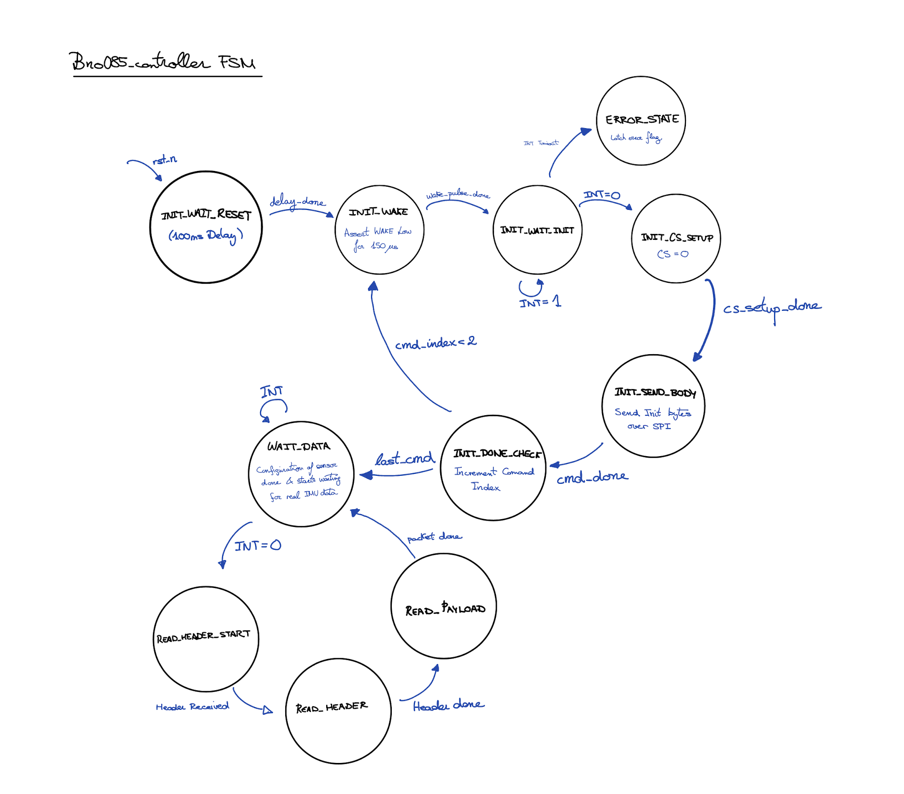{width="80%" style="max-width: 800px; margin: 2rem auto; display: block;"}

*Figure: FSM for the BNO085_controller.sv*

**IMU RST = 0** → RESET FPGA  
**IMU = 1** → Starts INT  
**IMU RST = 1** → Currently when flushing FPGA and hitting reset → imu_rst=1 and INT is oscillating between 0 and 1, now imu_rst=0 and hit the FPGA reset again and that seems to start the protocol

### SPI Signal Verification via Logic Analyzer

To validate the behavior of the `bno085_controller` FSM in hardware, we captured the SPI traffic between the FPGA and the BNO085 using a logic analyzer. Channel assignments are shown below:

| Logic Analyzer Channel | Signal | Description |
|------------------------|--------|-------------|
| D2 | MOSI | FPGA → BNO085 (SPI transmit data) |
| D3 | CS | Chip Select (active low) |
| D5 | INT | Sensor data-ready interrupt (active low) |

The figure below shows a complete initialization SPI transaction. The following behavior matches the expected sequence defined in the FSM:

1. **CS goes low** — This matches the INIT_CS_SETUP and INIT_SEND_BODY states, asserting chip select before sending the initialization command.

2. **MOSI shows valid transmitted bytes** — These correspond to the Set Feature SHTP command stored in `get_init_byte()` and transmitted in the INIT_SEND_BODY state.

3. **INT remains high during reset/wake** — The sensor has not yet completed boot.

4. **INT transitions LOW after configuration completes** — This transition causes the FSM to leave INIT_DONE_CHECK and enter WAIT_DATA, confirming that the BNO085 is awake, configured, and ready to provide IMU data.

Thus, the logic analyzer confirms correct timing and sequencing of the SPI transaction as dictated by the FSM.

{width="80%" style="max-width: 800px; margin: 2rem auto; display: block;"}

*Figure: FPGA data output trace on Logic Analyzer with FPGA configuration and initialization*

